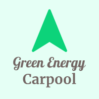

## Green Energy Carpooling System

<div align="center">
  
</div>

### Project Description

Welcome to the Green Carpooling System! This documentation provides an overview of the system's technology stack,
database, and the key features that drive its functionality. Our goal is to make eco-friendly transportation accessible
and convenient through carpooling.

## Technology Stack

The Green Carpooling System is built on a reliable and efficient technology stack to ensure a seamless user experience:

- **Laravel**: We use the Laravel PHP framework to power our web application. Laravel simplifies development and offers
  a clean, elegant syntax.

- **Tailwind CSS**: Our front-end is designed with Tailwind CSS, a utility-first framework that enables rapid and
  flexible styling, ensuring a user-friendly interface.

- **MySQL Database**: The system's data is securely stored in a MySQL database, renowned for its reliability and
  performance.

## System Architecture

The system follows the standard client-server architecture. Our Laravel application serves as the server, delivering the
user interface and functionalities to clients (web browsers).

## Data Storage

We entrust your data to a MySQL database, where user profiles, car details, carpool routes, and other essential
information are safely stored. MySQL ensures data integrity and efficient management.

## Key Features

### User Registration

Getting started is easy:

1. Provide your full name, email, phone number, and a secure password.
2. Agree to our terms and conditions.
3. Verify your email via a confirmation link.

### Car Registration

Car owners, follow these steps:

1. Log in and navigate to your profile's car registration section.
2. Upload a clear image of your car.
3. Enter your car's license plate, total seat capacity, and the number of seats offered for carpooling.

### Adding Routes

Share your carpool routes effortlessly:

1. After registering your car, access the carpool routes section in your profile.
2. Click "Add Route" and provide route details, including starting point, destination, departure time, and price.
3. Save the route information, making it available for users to search and request.

### User Restrictions and Rules

We have some rules in place to ensure everyone has a positive carpooling experience:

- **User Cannot Delete Route If Request Is Accepted or Pending**: Avoid inconveniencing other participants by not
  deleting routes with accepted or pending carpool requests.

- **User Cannot Delete Their Vehicle If It Has Routes**: We maintain ongoing carpool arrangements by preventing car
  owners from deleting vehicles with active routes.

- **User Cannot Request a Carpool in Their Own Vehicle**: Car owners cannot request rides in their own registered
  vehicles, keeping the carpooling concept intact.

## Conclusion

The Green Carpooling System brings together the power of Laravel, Tailwind CSS, and MySQL to offer a user-friendly,
reliable, and eco-conscious carpooling platform. By adhering to our user guidelines, we ensure a smooth experience for
all users, promoting sustainable and efficient transportation. Start carpooling and contribute to a greener future
today!

### Setup Project on your device

Run the following commands in your terminal

- git clone <repo-url>
- cd <repo-name>
- composer install
- npm install
- cp .env.example .env

```angular2html
NB: Go to .env file and change the database name, username and password

DB_CONNECTION=mysql
DB_HOST=127.0.0.1
DB_PORT=3306
DB_DATABASE=carpoolingsystem
DB_USERNAME=root
DB_PASSWORD=
```

- php artisan key:generate
- php artisan migrate
- php artisan db:seed
- php artisan serve
- npm run dev

#### Login Credentials

For Admin

```
email: admin@greencarpool.com
password: admin123
```

For User

```
email: johndoe@gmail.com
password: JohnDoe@123
```

You can change the credentials in the database seeder file

```
path: database/seeds/UserTableSeeder.php
```

### Project Screenshots

